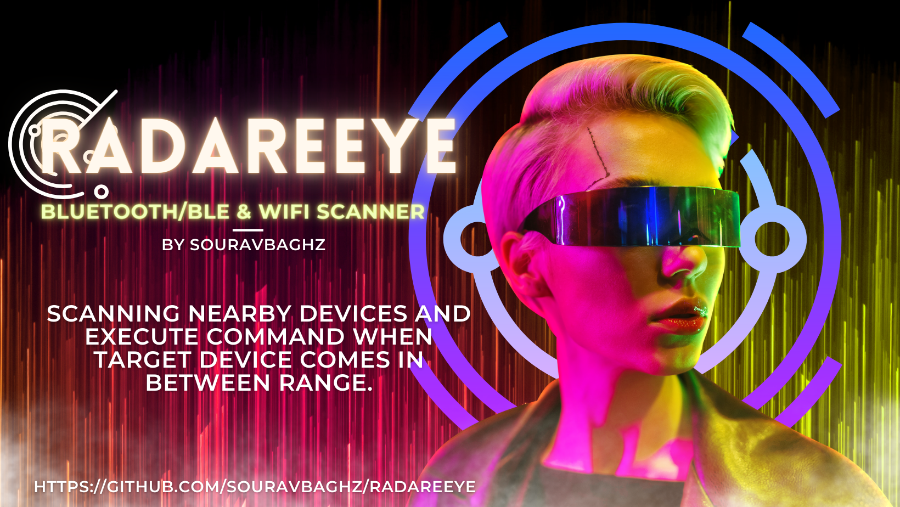

<p align="center">
  
</p>
<h3 align="center"><b>A tool for scanning nearby devices and execute command when the target device comes in between range..</b></h3>


*** 
**NOTE:- RadareEye Owner will be not responsible if any user performs malicious activities using this tool. Use it for Learning purpose only.**

+ **Installation of RadareEye :**
 ```
 git clone https://github.com/souravbaghz/RadareEye
 ```
### Usage:
```
./radare <mac_addr> <option>
```
### Available Options Are:
- -blue   Bluetooth RadareEye
- -ble    BLE radareEye
- -wifi   Wifi AP radareEye
***
+ **Running Bluetooth RadareEye :**
```
sudo bash radare XX:XX:XX:XX:XX:XX -blue
```
+ **Running BLE RadareEye :**
```
sudo bash radare XX:XX:XX:XX:XX:XX -ble
```
Same for the Wifi also with -wifi option, Here XX:XX:XX:XX:XX:XX means your target device's MAC Address & make sure to do with sudo (if you aren't root). I didn't add scanning feature in this script but you can get thr MAC Adress easily by executing 'hcitool scan' for bluetooth and 'hcitool lescan' for BLE Devices in terminal.
***
<p align="center">
  
</p>
After running RadareEye, It will ask you 'Command you want to trigger?' , you can skip it by simply keep it blank and it RadareEye will show you status of your target whether it's in range or not without triggering any command. If you want to trigger any command when your target comes in between range then enter a command when it asks.
 Examples :

+ **Below given command will shutdown our system imediatly when target device comes in range.**

```
[+]Command you want to trigger? :shutdown now
```
+ **It will run your other script**
```
[+]Command you want to trigger? :./myscript.py
```

 ### If you love my work then you can buy me a Coffee here.
 <a href="https://www.buymeacoffee.com/souravbaghz" target="_blank"></a>
 
 
 <br>

### 🤝 Connect with me
[](https://www.instagram.com/souravbaghz)
[](https://github.com/souravbaghz)
[](https://twitter.com/souravbaghz)
[](https://medium.com/@souravbaghz)

---

